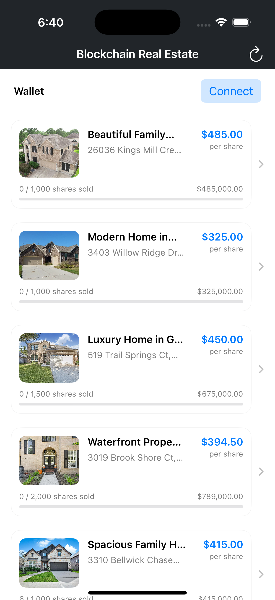
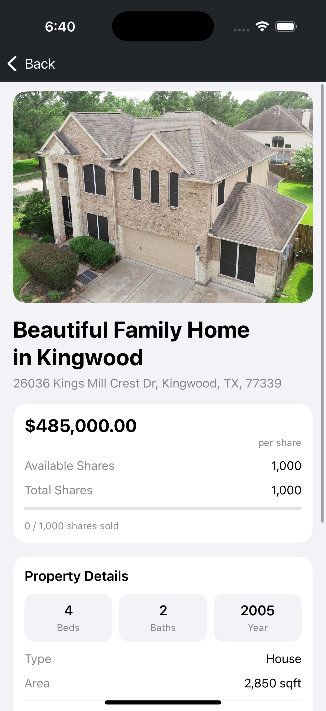

# Blockchain Real Estate iOS

A native SwiftUI client for the Blockchain Real Estate project. It focuses on browsing fractional real-estate listings and viewing property details (including an AI chat experience).

## Screenshots

<table>
  <tr>
    <td></td>
    <td></td>
  </tr>
</table>

## Features

- **Property feed**
  - Fetches property listings from the backend API
  - Displays title, address, images, share price, and sold progress
  - Pull-to-refresh via the refresh button

- **Property details**
  - Detailed property view with images and key stats
  - Property-specific AI chat UI

- **WalletConnect (in progress)**
  - WalletConnect v2 dependencies are wired into the Xcode project
  - Initial pairing UI has been started on the Home screen
  - Full “connect session / display address / buy shares” flow is still under active development

## Project structure

- `Blockchain-RealEstate-iOS/`
  - SwiftUI app source
- `Blockchain-RealEstate-iOS.xcodeproj/`
  - Xcode project
- `Blockchain-RealEstate-iOSTests/`, `Blockchain-RealEstate-iOSUITests/`
  - Test targets

## Requirements

- Xcode (latest recommended)
- iOS Simulator or an iOS device
- Backend API running locally

## Running the app

1. Open `Blockchain-RealEstate-iOS.xcodeproj` in Xcode.
2. Select a simulator/device target.
3. Build and run.

## Backend dependency

The iOS app expects the backend API to be available at:

- `http://localhost:4000`

It fetches properties from:

- `GET /api/properties`

If you see **“Error loading properties”** on the Home screen, make sure the backend server is running and reachable.

### Notes about `localhost`

- **iOS Simulator**: `localhost` usually resolves to your Mac, so `http://localhost:4000` can work.
- **Physical device**: `localhost` resolves to the device, so you’ll need to change the base URL to your Mac’s LAN IP.

## WalletConnect notes

The project uses WalletConnect v2 (`WalletConnectSwiftV2`). A WalletConnect Cloud Project ID is required for relay connectivity.

If you are developing on the simulator and want to connect with MetaMask installed on a phone, the typical workflow is to display the pairing URI as a QR code and scan it from MetaMask.
